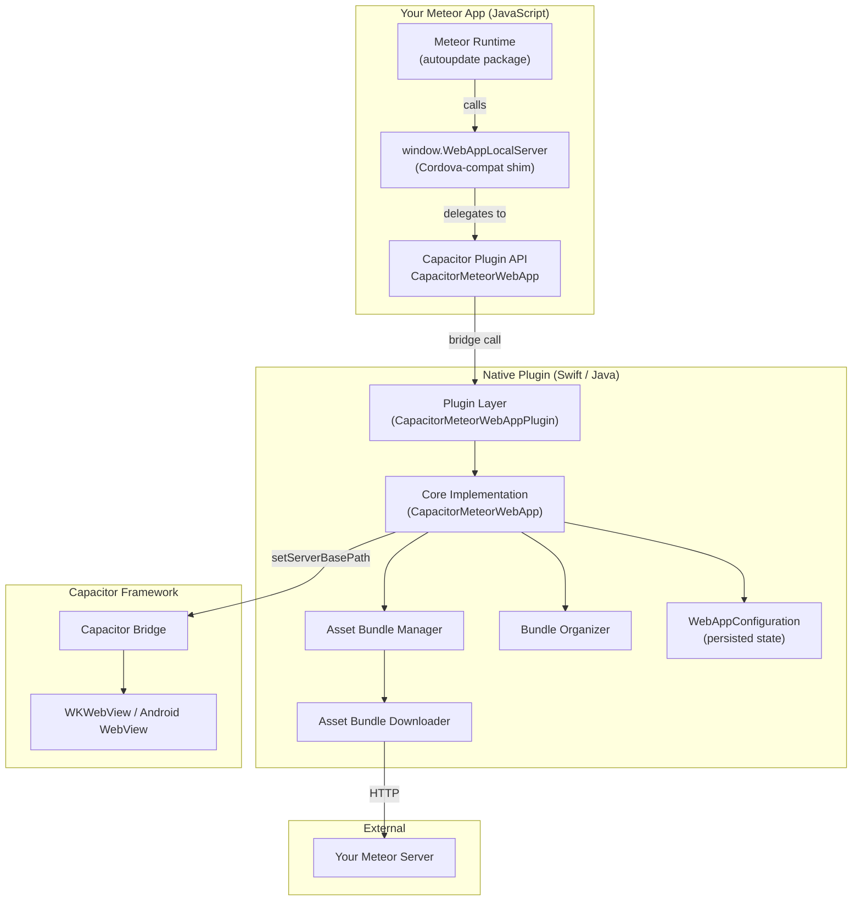
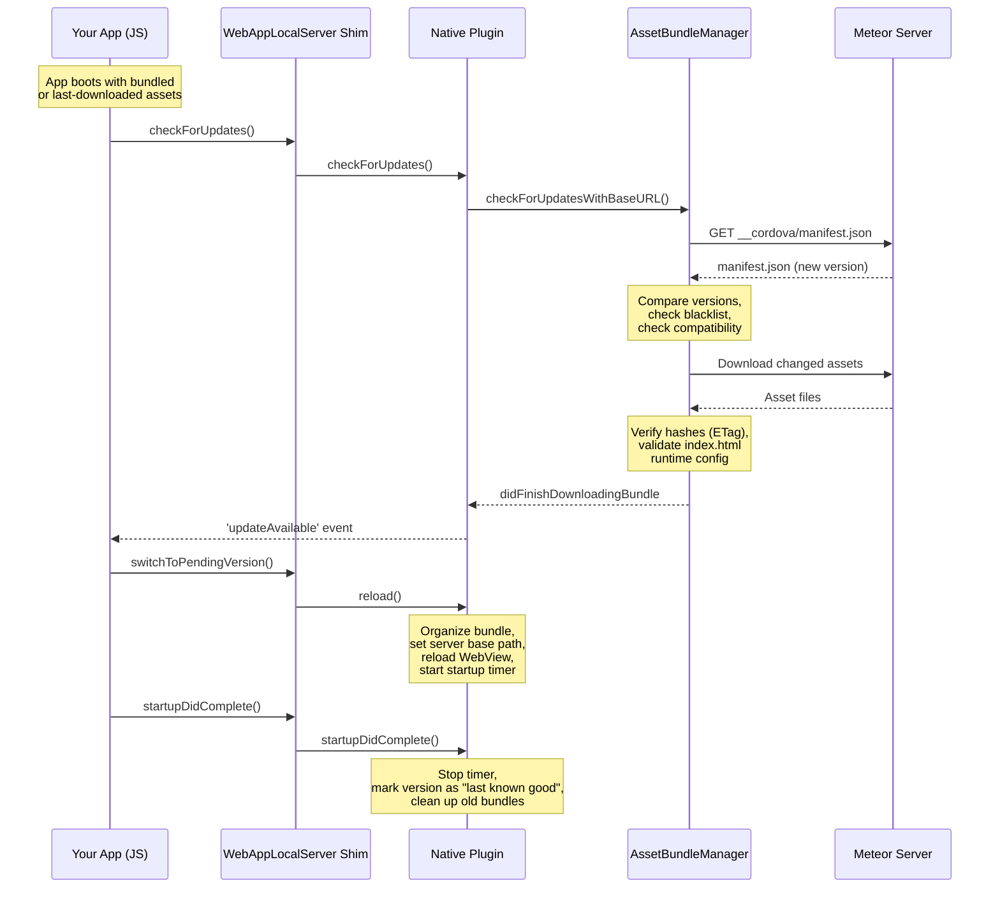
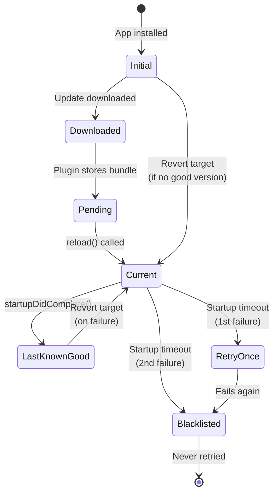

# Capacitor Meteor WebApp -- Architecture & How It Works

This document explains how the plugin works, what it does under the hood, and what you need to know as a Meteor app developer adopting it. It's not a setup guide (see [README.md](README.md) for that) -- it's the "how and why" behind the plugin.

## What This Plugin Does

Meteor's hot code push (HCP) lets you ship web code updates to mobile users instantly, without going through the App Store or Google Play. The original implementation lives in `cordova-plugin-meteor-webapp`. This plugin is a direct port for Capacitor.

The core job is simple: **detect that the server has new web assets, download them, and switch the app to use them -- safely, with automatic rollback if anything goes wrong.**

## Architecture Overview



There are three layers:

1. **JavaScript** -- Your Meteor app's runtime talks to `window.WebAppLocalServer`, which the plugin shims to bridge Cordova API calls to Capacitor plugin calls. You can also use the Capacitor API directly.

2. **Native Plugin** -- Swift (iOS) and Java (Android) implementations that manage asset bundles, downloads, version tracking, and failure recovery. The two platforms implement the same logic independently.

3. **Capacitor Bridge** -- The plugin tells Capacitor where to find the current web assets via `setServerBasePath()`. Capacitor's WebView serves files from that path.

## How Updates Work

This is the heart of the plugin. Here's the full lifecycle of an update, from detection through activation:



### The Key Steps

**1. Check for updates.** The plugin fetches `manifest.json` from `{ROOT_URL}/__cordova/manifest.json`. This is the same endpoint Meteor's Cordova integration has always used -- the plugin doesn't introduce any new server-side requirements.

**2. Decide whether to download.** Before downloading, the plugin checks:
- Is this the same version we're already running or already downloaded? Skip.
- Is this version blacklisted (previously failed to start)? Skip.
- Has the `cordovaCompatibilityVersion` changed? Skip. (This version string changes when native plugin versions change, indicating the web code may be incompatible with the installed native code.)

**3. Download efficiently.** Only *changed* assets are downloaded. The plugin uses a parent-child bundle model (explained below) where unchanged assets are reused from cached bundles (hard-linked on iOS, copied on Android). Partially downloaded bundles are preserved and resumed on retry.

**4. Verify integrity.** Downloaded assets are verified against their manifest hashes using the HTTP `ETag` header (when present). The `index.html` file gets special treatment -- its embedded `__meteor_runtime_config__` is parsed and the `autoupdateVersionCordova` field is compared against the expected version.

**5. Stage as pending.** The downloaded bundle is stored but not activated yet. The plugin fires an `updateAvailable` event so your app can decide when to switch (immediately, or after the user finishes what they're doing).

**6. Activate.** When `reload()` is called, the plugin organizes the pending bundle into a serving directory, points Capacitor's WebView at it, and reloads. A startup timer begins.

**7. Confirm or roll back.** Your app must call `startupDidComplete()` before the timer expires (30 seconds by default). If it does, the version is marked as "last known good" and old bundles are cleaned up. If it doesn't -- the plugin rolls back automatically.

## The Asset Bundle System

### What's in a Bundle

An asset bundle is a directory of files described by a `program.json` manifest. This is Meteor's standard format (`web-program-pre1`):

```json
{
  "format": "web-program-pre1",
  "version": "abc123def456...",
  "manifest": [
    {
      "path": "packages/meteor.js",
      "url": "/packages/meteor.js?hash=xyz",
      "type": "js",
      "cacheable": true,
      "hash": "sha1hexstring",
      "where": "client"
    }
  ],
  "cordovaCompatibilityVersions": {
    "ios": "...",
    "android": "..."
  }
}
```

Each entry has a `where` field -- the plugin only cares about entries where `where === "client"`. The `hash` field is a SHA-1 used for cache matching and ETag verification. The `version` is typically a hash of all the assets combined.

### Parent-Child Bundle Model

When a new version is downloaded, most assets are usually unchanged. The plugin avoids re-downloading and re-storing them using a parent-child relationship. The downloaded bundle only contains its **own** assets -- the ones that changed. When a bundle is organized for serving, the plugin also pulls in any parent assets that the child doesn't override. This means downloading a new version is fast and storage-efficient.

### Bundle Organization

Meteor's asset bundles store files by their build path (e.g., `packages/meteor.js`), but Capacitor's WebView needs files at their URL paths (e.g., `/packages/meteor.js?hash=xyz` -> `packages/meteor.js`). The **BundleOrganizer** bridges this gap.

When a bundle is activated, the organizer:

1. **Validates** asset paths (rejects path traversal/malformed paths and duplicate normalized URL paths)
2. **Creates a serving directory** with files placed at their URL paths (query strings stripped)
3. **Links or copies** files from the bundle directory into the serving directory (iOS uses hard links with copy fallback; Android copies)
4. **Injects the Cordova compatibility shim** into `index.html` (see below)
5. **Inherits parent assets** -- if the downloaded bundle doesn't override an asset from the initial bundle, the parent's version is included

The serving directory is what Capacitor's `setServerBasePath()` points to. Old serving directories are cleaned up after each switch.

## The Cordova Compatibility Shim

This is how the plugin achieves zero-change compatibility with existing Meteor apps.

Meteor's `autoupdate` package (and other parts of the Meteor runtime) expect to find `window.WebAppLocalServer` -- an object provided by the original Cordova plugin. Instead of requiring you to rewrite your app to use Capacitor APIs, this plugin **injects a shim script into `index.html`** during bundle organization.

The shim creates `window.WebAppLocalServer` and maps each method to its Capacitor equivalent:

| Cordova API (`window.WebAppLocalServer`) | Capacitor Plugin Call |
|---|---|
| `startupDidComplete(callback)` | `CapacitorMeteorWebApp.startupDidComplete()` |
| `checkForUpdates(callback)` | `CapacitorMeteorWebApp.checkForUpdates()` |
| `onNewVersionReady(callback)` | `addListener('updateAvailable', ...)` |
| `switchToPendingVersion(cb, errCb)` | `CapacitorMeteorWebApp.reload()` |
| `onError(callback)` | `addListener('error', ...)` |
| `localFileSystemUrl(url)` | **Not supported** -- throws an error |

The shim initializes lazily: it waits for either `window.Capacitor` to be present or the `deviceready` event, then resolves the plugin reference on first use. This ensures the Capacitor bridge is ready before any calls are made.

**`localFileSystemUrl()` is the one exception.** The original Cordova plugin embedded its own HTTP server to serve local files at `/local-filesystem/...` URLs. Capacitor doesn't need a local server (it serves files directly from the filesystem), so this URL scheme isn't available. If you need local file access, use `@capacitor/filesystem` instead.

### When Is the Shim Injected?

The shim is injected by the BundleOrganizer at **bundle organization time** -- not at build time, not at download time, but when a bundle is being prepared for serving. It's inserted just before `</head>` in `index.html`. This means:

- The shim is always present, whether serving the initial bundle or a downloaded update
- The original `index.html` files on disk are never modified
- If a Cordova plugin already set up `WebAppLocalServer`, the shim detects this and does nothing

## Version & Failure Management

The plugin tracks several version states to ensure reliability:



### Persisted State

All version state is persisted across app launches (iOS: `UserDefaults`, Android: `SharedPreferences`):

| Key | Purpose |
|---|---|
| `lastSeenInitialVersion` | Detects app store updates -- if the bundled version changes, all downloaded versions and state are wiped |
| `lastDownloadedVersion` | The version to boot into on next cold start |
| `lastKnownGoodVersion` | The last version where `startupDidComplete()` was called |
| `blacklistedVersions` | Versions that failed startup twice and should never be downloaded again |
| `versionsToRetry` | Versions that failed once -- they get one more chance before blacklisting |

### The Startup Timer

After switching to a new version, the plugin starts a 30-second countdown. If your app doesn't call `startupDidComplete()` in time, the plugin assumes the update is broken and:

1. **Blacklists** the current version (first failure goes to retry list; second failure permanently blacklists)
2. **Reverts** to the last known good version, or the initial bundle if there isn't one
3. **Reloads** the WebView with the fallback version

The timer is paused when the app goes to the background and resumed when it returns to foreground (on both iOS and Android), to avoid false positives while the WebView is suspended.

### App Store Update Detection

When the app is updated through the App Store / Google Play, the bundled assets may change. The plugin detects this by comparing `lastSeenInitialVersion` against the current initial bundle's version. If they differ, **all downloaded bundles, serving directories, and persisted state are wiped clean**, and the app starts fresh from the new bundled assets. This prevents stale downloaded versions from overriding a newer app store release.

### Cordova Compatibility Version Guard

Each asset manifest includes a `cordovaCompatibilityVersion` (one per platform). This string changes when native plugin versions change. If a downloaded manifest's compatibility version doesn't match the currently running one, the download is skipped entirely. This prevents the app from loading web code that expects native APIs that aren't available in the installed binary.

## The Download System

### Efficient Downloads

The downloader only fetches assets that:
- Are new or changed (not present in any cached bundle with matching hash)
- Aren't already being downloaded
- Aren't source maps that 404'd (gracefully skipped)

Assets are downloaded in parallel (up to 6 concurrent connections). Each download is verified:
- **Hash check**: The `ETag` response header is compared against the expected SHA-1 hash from the manifest
- **Index verification**: `index.html` is parsed to extract `__meteor_runtime_config__` and verify the version matches, the `ROOT_URL` isn't unexpectedly `localhost`, and the `appId` matches

### Retry & Resilience

When downloads fail, the plugin uses a **triangular backoff** strategy:

| Attempt | Delay |
|---|---|
| 1st retry | 0.1s (quick retry for transient failures) |
| 2nd | 1s |
| 3rd | 2s |
| 4th | 4s |
| 5th | 7s |
| ... | ceiling at 30s |

The downloader also:
- **Monitors network reachability** and resumes immediately when connectivity returns
- **Resumes partial downloads** using HTTP resume data when available (iOS)
- **Survives backgrounding** on iOS via a background task (up to ~180s), and resumes when the app returns to foreground
- **Preserves partial bundles** -- if a download is interrupted and a new check starts, already-downloaded assets from the previous attempt are reused

## Public API

### Capacitor Plugin API

```typescript
interface CapacitorMeteorWebAppPlugin {
  // Signal that app startup completed successfully.
  // Stops the startup timer and marks the current version as "last known good".
  startupDidComplete(): Promise<void>;

  // Trigger an update check against the Meteor server.
  // Downloads happen in the background; listen for events to know the result.
  checkForUpdates(): Promise<void>;

  // Get the version string of the currently running bundle.
  getCurrentVersion(): Promise<{ version: string }>;

  // Check whether a downloaded update is staged and ready to activate.
  isUpdateAvailable(): Promise<{ available: boolean }>;

  // Activate the pending update: reorganize bundle, switch base path, reload WebView.
  reload(): Promise<void>;

  // Fired when a new version has been downloaded and is ready to activate.
  addListener(event: 'updateAvailable', cb: (e: { version: string }) => void);

  // Fired on download failures, version incompatibilities, etc.
  addListener(event: 'error', cb: (e: { message: string }) => void);

  removeAllListeners(): Promise<void>;
}
```

### Cordova-Compatible API (`window.WebAppLocalServer`)

If your Meteor app already uses the standard Cordova hot code push flow, you don't need to change anything. The injected shim provides:

```typescript
window.WebAppLocalServer = {
  startupDidComplete(callback?: () => void): void;
  checkForUpdates(callback?: () => void): void;
  onNewVersionReady(callback: (version: string) => void): void;
  switchToPendingVersion(callback?: () => void, errorCallback?: (error: Error) => void): void;
  onError(callback: (error: Error) => void): void;
  localFileSystemUrl(fileUrl: string): never; // throws -- not supported
};
```

Meteor's `autoupdate` package calls these methods automatically. You typically don't call them directly unless you've customized your update flow.

## File Layout on Device

```
App Bundle (read-only)
  └── public/                          # Initial assets shipped with the app
       ├── program.json                # Asset manifest
       ├── index.html
       ├── packages/
       └── ...

Library/NoCloud/meteor/                # iOS: downloaded bundles
  (or) files/meteor/                   # Android: downloaded bundles
  ├── {version-hash}/                  # Each downloaded version
  │    ├── program.json
  │    └── (only changed assets)
  ├── Downloading/                     # In-progress download
  └── PartialDownload/                 # Preserved partial download

Library/NoCloud/meteor-serving/        # iOS: organized for serving
  (or) files/meteor-serving/           # Android: organized for serving
  └── {version-hash}/                  # Active version, files at URL paths
       ├── index.html                  # (with shim injected)
       ├── packages/
       │    └── meteor.js              # (linked or copied from bundle dir)
       └── ...
```

Only one serving directory exists at a time. Old ones are cleaned up after each bundle switch.

## Platform Differences

The iOS (Swift) and Android (Java) implementations are closely aligned and share the same core architecture (bundle/version management, update flow, and shim injection). There are minor platform-specific differences in a few implementation details:

- **Storage locations**: iOS uses `Library/NoCloud/` (excluded from iCloud backup); Android uses `context.getFilesDir()`
- **Persistence**: iOS uses `UserDefaults`; Android uses `SharedPreferences`
- **Networking**: iOS uses `URLSession`; Android uses `HttpURLConnection`
- **Lifecycle**: both platforms pause/resume the startup timer across background/foreground transitions (iOS via `didEnterBackground`/`willEnterForeground`, Android via `onPause`/`onResume`)
- **Manifest compatibility key**: iOS reads `cordovaCompatibilityVersions.ios`; Android reads `cordovaCompatibilityVersions.android` -- as expected, since native plugin versions differ per platform
